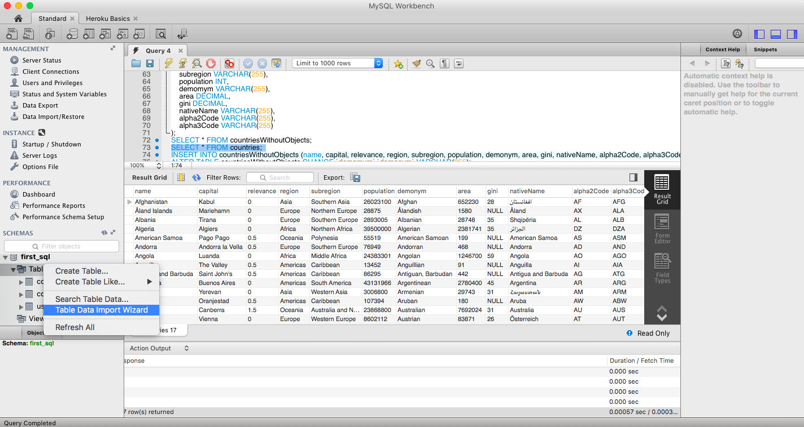
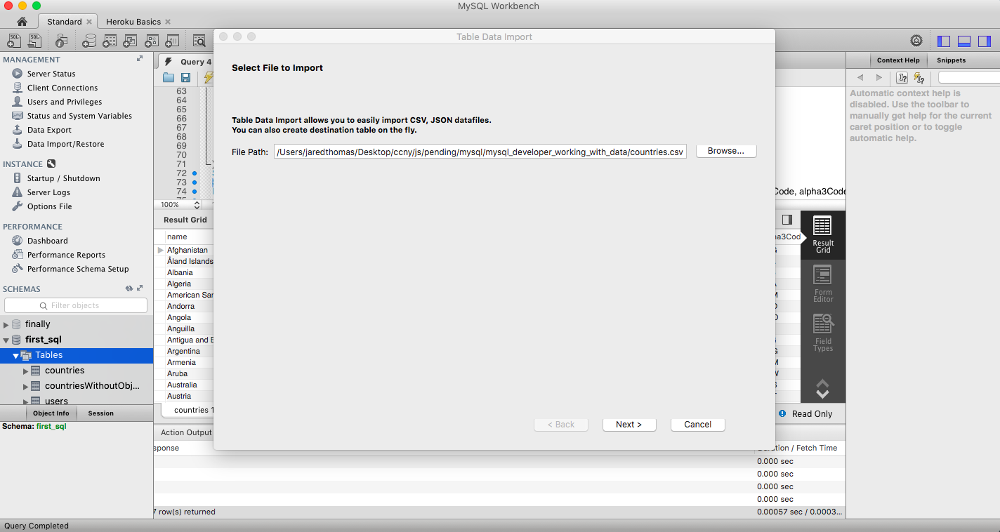
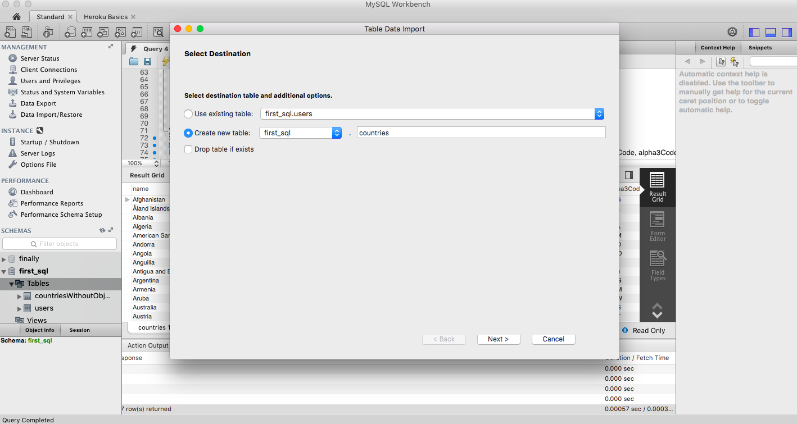
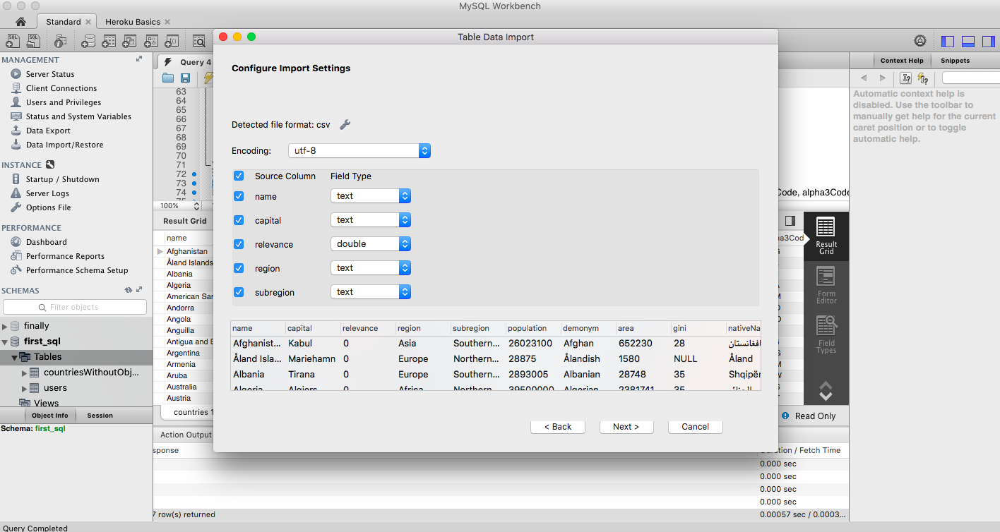
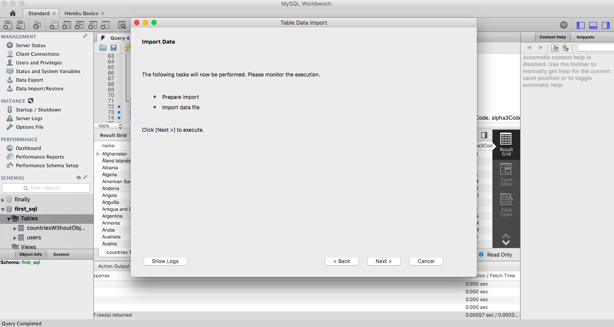

# Working with Database Data

## 1. Importing data from .csv file to database and creating 'countries' table
* In MySql Developer:
  * Step 1
    * On the left hand side, under "Schemas", you will see your 'first_sql' database listed
    * Right click on "Tables" under the "first_sql" database, and click on "Table Data Import Wizard"
    * 
  * Step 2
    * Select the .csv file as part of this project as the file to import here
    * 
  * Step 3
    * MySql should auto-populate the table name based on the file name 'countries'
    * 
  * Step 4
    * MySql should auto-populate the table columns as well based on the .csv file
    * 
  * Step 5
    * Click on 'next' and this will execute the data insertion from the .csv file
    * 
## 2. Running queries against 'countries' table
  * See 'schema.sql' file
